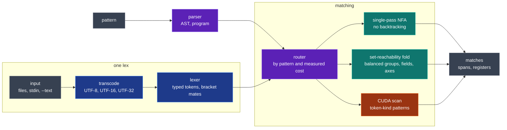

<div align="center">

# TREX (Token Regular EXpression)

**A regex-shaped pattern language over typed tokens.**

[](https://github.com/Variably-Constant/trex/blob/main/Cargo.toml)
[](https://variably-constant.github.io/trex/docs/reference/python/)
[](https://variably-constant.github.io/trex/docs/reference/powershell/)
[](https://variably-constant.github.io/trex/docs/how-to/choose-a-backend/)

**[Documentation](https://variably-constant.github.io/trex/)** | [Getting started](https://variably-constant.github.io/trex/docs/tutorial/getting-started/) | [Pattern syntax](https://variably-constant.github.io/trex/docs/reference/pattern-syntax/) | [Command reference](https://variably-constant.github.io/trex/docs/reference/cli/)

The lexer reads the input once into typed tokens and a pattern matches over them: `\N` is one whole number, `\E` one email address, `\B(...)` one balanced bracket group, and the whitespace between tokens is never written. A capture binds a named register that a later `=name` must equal. Matching does not backtrack. trex is a command-line binary, a Rust library, a Python module and a PowerShell module.

</div>

---

<details>
<summary><b>Table of contents</b></summary>

- [Features](#features)
- [Quick start](#quick-start)
- [Why trex](#why-trex)
- [What a pattern can say](#what-a-pattern-can-say)
- [Commands](#commands)
- [Architecture](#architecture)
- [Performance](#performance)
- [Repository layout](#repository-layout)
- [Building and testing](#building-and-testing)
- [Platforms and MSRV](#platforms-and-msrv)
- [Wiki](#wiki)
- [Credits and influences](#credits-and-influences)
- [Use of AI tools](#use-of-ai-tools)
- [License](#license)

</details>

---

## Features

<details open>
<summary><b>What you get</b></summary>

- 25 built-in token kinds, from numbers and words to IP addresses, URLs, timestamps and payment cards, each one atom.
- [Value predicates](https://variably-constant.github.io/trex/docs/reference/pattern-syntax/#typed-value-predicates) in a kind's own units: `\N{500..599}`, `\I{in:10.0.0.0/8}`, `\T{age<24h}`.
- Balanced groups and named registers, with back-references exact or up to case, shape, representation or a typed relation.
- [Custom atoms](https://variably-constant.github.io/trex/docs/reference/pattern-syntax/#declared-names-and-the-library) declared in a file with `test` lines, beside a shipped library of 75 named kinds and patterns.
- [Rewrites](https://variably-constant.github.io/trex/docs/how-to/rename-matches/) that slice a capture by its typed fields, and redaction that keeps named fields.
- Files, standard input and directories walked under `.gitignore` rules, with in-place rewriting behind a diff dry run.
- [`head`, `tail` and `lines`](https://variably-constant.github.io/trex/docs/reference/cli/#head-tail-lines), and the same windows on a scan, a rewrite or a redaction, read from the end of a file they sit at; `--follow` reads on as the file grows.
- [Ten property axes](https://variably-constant.github.io/trex/docs/reference/axes/), read by a command over the token stream or as a term inside a pattern.
- A [CUDA backend](https://variably-constant.github.io/trex/docs/how-to/choose-a-backend/) in the default build for patterns that read only token kinds.
- A [PowerShell module](https://variably-constant.github.io/trex/docs/reference/powershell/) of 49 cmdlets that write matches, findings and reports as objects, with each register's value as a .NET type.

</details>

## Quick start

Install the command from crates.io, where the package is `trex-re`; the command it installs is `trex`:

```text
cargo install trex-re
```

A command reads files, directories, `-` for standard input, or `--text`:

```console
$ trex scan '\E:e' --text 'ping bob@x.com' --json
[{"start":5,"end":14,"text":"bob@x.com","captures":{"e":"bob@x.com"}}]

$ trex rewrite '\E:e' '[${e:domain}]' --text 'mail bob@x.com now'
mail [x.com] now

$ trex redact '\E:e' --keep e:domain --text 'mail bob@x.com now'
mail ****x.com now
```

A directory is walked with hidden and binary files skipped, each match carries its path, line and column, and `-C` prints the lines around it. With `logs/a.log` holding the five lines `alpha 10`, `beta 20`, `gamma 300`, `delta 4000` and `epsilon 5`:

```console
$ trex scan '\N{>=1000}' logs/ -C 1
logs/a.log-3-gamma 300
logs/a.log:4:7: "4000"
logs/a.log-5-epsilon 5
```

As a library, the package is `trex-re` and the crate it names is `trex`:

```toml
[dependencies]
trex-re = "0.1.0"
```

The Python module installs from PyPI:

```text
pip install trex-re
```

```python
>>> import trex
>>> m = trex.Pattern(r"<\W:t>.*</=t>").find("say <div>hi</div> now")
>>> (m.start, m.end, m.text, m["t"])
(4, 17, '<div>hi</div>', 'div')
```

The PowerShell module installs from the PowerShell Gallery:

```powershell
Install-Module Trex
```

```powershell
PS> Select-TrexMatch '\R:t' -InputObject 'retried after 1500ms' | ForEach-Object { $_.Groups[0].Value.TotalSeconds }
1.5

PS> 'mail bob@x.com now' | Protect-TrexText '\E:e' -Keep e:domain
mail ****x.com now
```

## Why trex

A regular expression reads bytes, so a number is written `[-+]?\d+(?:\.\d+)?`, the space between two items is `\s*`, and a capture is numbered by where its parenthesis falls. trex reads tokens. The lexer decides where a number ends, whitespace does not appear in a pattern, and a capture has a name, so adding a group renumbers nothing.

A pattern can also require what a regular expression cannot. Here the closing tag must equal the opening one:

```console
$ trex scan '<\W:t>.*</=t>' --text '<div>hi</div>'
[0..13] "<div>hi</div>"  captures: t="div"
```

`\W:t` binds the tag's word to the register `t`, and `=t` requires a later token equal to it. The engine keeps registers per thread instead of backtracking. With a bind one token wide, scan time grew at 0.91x to 1.06x of linear from 25,000 to 6,400,000 tokens. A bind of unbounded width, `\W+:x =x`, grew quadratically from 500 to 8,000 tokens. [`examples/backref_scaling.rs`](https://github.com/Variably-Constant/trex/blob/main/examples/backref_scaling.rs) runs both, and [what regex has and trex spells differently](https://variably-constant.github.io/trex/docs/reference/pattern-syntax/#what-regex-has-and-trex-spells-differently) maps each regex construct.

## What a pattern can say

The construct families, each with the section that defines it. [`examples/patterns.rs`](https://github.com/Variably-Constant/trex/blob/main/examples/patterns.rs) runs each one against a real input and asserts its match count.

<details>
<summary><b>The pattern language</b></summary>

| Construct | Example | Reference |
|---|---|---|
| Token atoms | `\N` `\W` `\Q` `\I` `\E` `\T` `\{uuid}` `\{phone}` | [token atoms](https://variably-constant.github.io/trex/docs/reference/pattern-syntax/#token-atoms) |
| Byte classes and byte-patterns inside one token | `\d`, `` `[A-Z]{2,4}-\d{1,4}` `` | [byte classes](https://variably-constant.github.io/trex/docs/reference/pattern-syntax/#byte-classes) |
| Sequence, choice, repetition | `A B`, `A\|B`, `A*`, `A{2,4}` | [sequence](https://variably-constant.github.io/trex/docs/reference/pattern-syntax/#sequence-choice-and-repetition) |
| Value predicates | `\N{500..599}`, `\V{>=2.0,<3}`, `\Z{>1GiB}`, `\T{age<24h}` | [typed value predicates](https://variably-constant.github.io/trex/docs/reference/pattern-syntax/#typed-value-predicates) |
| Quantities in any unit | `\{qty}{>5kg}` | [quantities](https://variably-constant.github.io/trex/docs/reference/pattern-syntax/#quantities) |
| Decoded content | `\{jwt}{alg:none}`, `\{base64}{bits>7}` | [decoded content](https://variably-constant.github.io/trex/docs/reference/pattern-syntax/#decoded-content) |
| Balanced groups, registers and back-references | `\B(...)`, `\W:t ... =t`, `=case t`, `=subnet a` | [binding](https://variably-constant.github.io/trex/docs/reference/pattern-syntax/#binding-back-reference-and-symmetry) |
| Guards | `~"lit"`, `!~"lit"` | [assertions and guards](https://variably-constant.github.io/trex/docs/reference/pattern-syntax/#assertions-and-guards) |
| Line position | `^A`, `A$` | [where a match stands](https://variably-constant.github.io/trex/docs/reference/pattern-syntax/#where-a-match-stands) |
| Lenses | `@call`, `@block`, `@kv`, `@list` | [lenses](https://variably-constant.github.io/trex/docs/reference/pattern-syntax/#lenses) |
| Axis predicates and anchors | `\M{>6}`, `\F{entropy>0.8}`, `@seam`, `@echoed` | [axis predicates](https://variably-constant.github.io/trex/docs/reference/pattern-syntax/#axis-predicates-and-anchors) |
| Declared names and the library | `\{ticket}`, `\{iban}`; `let`, `kind`, `shape`, `rule` and `test` lines | [declared names](https://variably-constant.github.io/trex/docs/reference/pattern-syntax/#declared-names-and-the-library) |
| Rewrite accessors | `${ip:octet1-2}`, `${email:domain}`, `${t:upper}` | [rewrite accessors](https://variably-constant.github.io/trex/docs/reference/pattern-syntax/#rewrite-accessors) |

</details>

## Commands

Sixteen pattern tools and ten analysis commands. Every flag is in the [command reference](https://variably-constant.github.io/trex/docs/reference/cli/).

<details>
<summary><b>Twenty-six commands</b></summary>

| Command | Does |
|---|---|
| `scan` | each match with its span and registers, as text, JSON, a template per match, or with context lines |
| `head`, `tail`, `lines` | an input's first lines, its last, or a range, each at its own number; `tail -f` follows a growing file |
| `rewrite` | replace each match with a rendered template; `--in-place` behind a `--dry-run` diff |
| `redact` | mask each match, keeping the named fields |
| `templates` | each distinct record shape once, with its count |
| `infer` | the most specific pattern every example matches |
| `top`, `count-by`, `uniq` | matches grouped by a rendered key |
| `index` | index a tree so a later scan opens only the files that can match |
| `lib` | the shipped library; `--test` runs a pattern file's `test` lines |
| `prefilter` | which literals might occur, through a Bloom, Cuckoo or Xor filter |
| `grammar` | a parse against a token grammar, with semiring values |
| `bpe` | train and apply a byte-pair-encoding subword tokenizer |
| `magnitude`, `spectral`, `shape`, `orbit`, `seam`, `stress`, `flow`, `observe`, `echo` | one [property axis](https://variably-constant.github.io/trex/docs/reference/axes/) each |
| `relation` | directed relations between tokens and the readings over that graph |

</details>

A build with `--features compress` adds `compress`, which reports the code length a context-mixing model assigns to the input.

## Architecture



[The architecture page](https://variably-constant.github.io/trex/docs/explanation/architecture/) maps every module and execution surface, and [the engine](https://variably-constant.github.io/trex/docs/explanation/the-engine/) explains the two matchers.

<details>
<summary><b>Rules that hold at every surface</b></summary>

- The engine runs over the significant tokens only; whitespace never reaches it.
- A pattern the device cannot represent runs on the engine, so the two never disagree.
- Lexing across cores is byte-identical to the serial lexer, and a chunked scan returns the whole-input match set.
- On the subset shared with a regular expression, the single-pass engine reports the `regex` crate's spans on all 20,000 generated cases in `tests/conformance.rs`.

</details>

## Performance

trex, the `regex` crate, Python's `re` and Perl over one generated corpus, each asked to compile, test, find, count, capture, replace and split with the same patterns. Windows 11 on a Ryzen 9 7900X, the default build with the GPU disabled, summed over the 68 rows every engine answered:

| Statements | Corpus | trex | regex | Python `re` | Perl |
|---|---|---|---|---|---|
| 25,000 | 0.86 MB | 11.9 ms | 36.3 ms | 416.7 ms | 201.5 ms |
| 400,000 | 14.97 MB | 176.0 ms | 633.5 ms | 7,169.2 ms | 3,298.3 ms |

Over the 149 operations both trex and `regex` can express, `regex` is faster on 73 and trex on 76, and trex finishes the set 3.65x to 3.69x faster across two passes. The harnesses in [`benches/`](https://github.com/Variably-Constant/trex/tree/main/benches) produce every row.

## Repository layout

| Path | Role |
|---|---|
| `src/` | the library, and the `trex` binary in `src/main.rs` |
| `kernels/` | CUDA kernels compiled to PTX at build time |
| `examples/` | runnable examples; `patterns.rs` asserts every construct |
| `tests/` | integration tests; `wiki_examples.rs` runs every console block in this file and the wiki against the built binary |
| `tests/documented/` | the files those console blocks read |
| `benches/` | the harnesses behind the performance figures above |
| `wiki/` | the Hugo site |
| `python/` | the crate behind the `trex-re` wheel |
| `powershell/` | the crate behind the `Trex` PowerShell module, and its Pester suites |
| `_corpus/` | the English sample and the prior the `compress` feature compiles in |

## Building and testing

```text
cargo build --release                          # default features: gpu, tandem
cargo build --release --no-default-features    # CPU only, no CUDA dependency
cargo build --release --features compress      # adds trex compress and its 21.6 MB prior
cargo test --profile release-test              # every test target, documented examples included
cargo clippy --all-targets --all-features
```

The Python module builds from `python/` into the active virtual environment with `pip install maturin` and then `maturin develop --release -m python/Cargo.toml`.

The PowerShell module builds with [PWRS](https://github.com/Variably-Constant/PWRS) 0.3.1 from crates.io and `cargo pwrs` of the same release, `cargo install cargo-pwrs --version 0.3.1`. In `powershell/`, `cargo pwrs build --release` builds the module into `target/pwrs/Trex` and `cargo pwrs test --release` runs its Rust tests and then its Pester suites, the documented PowerShell examples among them, in PowerShell 7 and in Windows PowerShell 5.1. The report suites compare the module's output with the command's, so `TREX_CLI` names a trex binary built from the same tree.

| Feature | Default | Adds |
|---|---|---|
| `gpu` | on | the CUDA scan backend through `cudarc`; without `nvcc` at build time the binary runs on the CPU |
| `tandem` | on | CPU and GPU batch dispatch through the scheduler's hybrid join; implies `gpu` |
| `compress` | off | `trex compress`, the coder options of `trex seam`, and the 21.6 MB byte-ngram prior they read; it builds from a checkout, since the published crate leaves the prior out |

| Variable | Read by | Effect |
|---|---|---|
| `TREX_PARALLEL_LEX_THRESHOLD` | the lexer | the input size in bytes from which lexing runs across cores |
| `TREX_TRACE` | every route | print to standard error which route answered each call |
| `TREX_SEAM_CLUSTER_REPORT` | the seam field | with a clustering vigilance set in `SeamConfig`, print how many context classes it kept |
| `TREX_KIND_COLOR` | `scan` | how much of a line the token kinds paint: `none`, `values` or `all`, as `--colors kind:*:LEVEL` sets for one run |
| `NO_COLOR`, `TERM`, `COLORTERM` | `scan` | the color depth, as other terminal tools read them |
| `VISUAL`, `EDITOR` | `-i` review | the editor the `e` answer opens |
| `CUDA_VISIBLE_DEVICES` | the CUDA driver | `-1` hides the device, so the default build runs on the CPU |

## Platforms and MSRV

- Rust 1.96 or later, edition 2024; the PowerShell module's crate needs 1.98.
- The command and the library are built and tested on Windows 11 x64, and the published crate builds with or without a CUDA toolkit.
- The `gpu` feature compiles `kernels/scan.cu` with `nvcc` at build time where `nvcc` is installed, and loads it through the NVIDIA driver at run time. A build without `nvcc`, or a machine without a device, runs on the CPU.
- Python 3.11 or later, from stable-ABI wheels for Windows x64, Linux x64 (`manylinux_2_28`) and macOS arm64, each tested when it is built, and from the source distribution elsewhere.
- PowerShell 7 and Windows PowerShell 5.1, from one module carrying Windows x64, Linux x64, FreeBSD x64 and macOS arm64; its Pester suites pass on each.

## Wiki

The documentation site is at **[variably-constant.github.io/trex](https://variably-constant.github.io/trex/)**, built from [`wiki/`](https://github.com/Variably-Constant/trex/tree/main/wiki) by `.github/workflows/wiki-deploy.yml` on every push to main that changes it.

It is a Hugo site using the Hextra theme, organized by the Diataxis framework: five tutorials, eight how-to guides, four explanations, and reference pages for the commands, the pattern syntax, the library API, the Python module, the PowerShell module and each property axis.

## Credits and influences

- The conformance tests hold the single-pass engine to the spans of the [regex](https://github.com/rust-lang/regex) crate's PikeVM, and the engine lays out a loop as that crate's compiler does.
- The set-reachability fold is the operational form of Antimirov's partial derivatives, over a token alphabet with a register environment.
- [ignore](https://crates.io/crates/ignore), ripgrep's directory walker, applies `.gitignore` and `.ignore` rules to every directory argument.
- [cudarc](https://crates.io/crates/cudarc) loads the PTX kernel and drives the device.
- [Flynnel](https://crates.io/crates/flynnel) schedules the parallel lexer and the tandem CPU and GPU dispatch.
- [PyO3](https://github.com/PyO3/pyo3) and [maturin](https://github.com/PyO3/maturin) build the Python module.
- [PWRS](https://github.com/Variably-Constant/PWRS) builds the PowerShell module.

## Use of AI tools

The author used Claude (Anthropic) via the Claude Code CLI for code development assistance, documentation drafting, and benchmark scripting during the preparation of this repository. All design decisions and the final content were determined by the author. The implementation, the tests and the benchmark results were verified through zero-warning `cargo clippy` in four feature configurations, `cargo test` of every target in the default and `compress` builds, a test that runs every documented command against the built binary, the PowerShell module's Pester suites in PowerShell 7 and Windows PowerShell 5.1, and end-to-end runs of the release binaries on Windows 11 x64.

## License

MIT, as written in [`LICENSE-MIT`](https://github.com/Variably-Constant/trex/blob/main/LICENSE-MIT).
